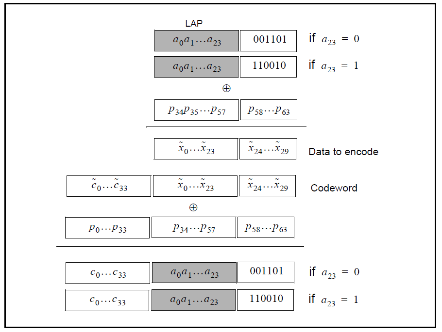

# Bluetooth Access Code Generator

BTACCESSCODE is a MATLAB and GNU Octave compatible implementation of Bluetooth's ACCESS CODE. The ACCESS CODE is used in the physical layer for device detection and synchronization.

# Files
* btaccesscode.m - Calculate access code from Lower Address Part
* btsyncgen.m - The "workhorse", calculate 64-bit sync word from Lower Address Part
* test_accesscode.m - Test access code calculation against test data from the Standard
* test_syncgen.m - Test sync word calculation against test data from the Standard
* load_test_data.m - Load test data from the Standard into the workspace

# Examples
### 1. Calculate Access Code using a sample from Appendix G of [1]

~~~~
[acbin,acstr,achex] = btaccesscode(0x61650c);
disp(achex)
aec4c69b54c29a18d5
~~~~

# References
1. **[Bluetooth Core Specification, Version 5.4 Vol 2, Parts B and G](https://www.bluetooth.com/specifications/specs/)**  

> Written with [StackEdit](https://stackedit.io/).
